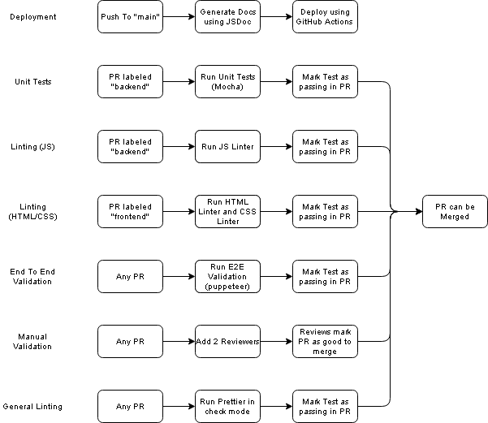

# CI/CD Phase 2

## Overall Pipeline Architecture

Rather than create one large pipeline with many steps which increases complexity, we decided to create many small independent pipelines which work in parallel to conduct code quality checking. Using this strategy, if any one pipeline has issues, we can still continue development without delay, and the quality of code is likely to remain high. 

## Overview of Pipeline Features

We've identified 5 major features which we definitely want to implement in the CI/CD pipeline. 

- Deployment
- Unit Testing 
- Linting
- End To End Validation
- Manual Validation

We created this diagram to demonstrate our strategy of multiple simple pipelines.

## Finished Features and Implementation

So far the features listed below have been completed to some degree:

- Deployment
	- Implemented: action triggered on any push to main, uses the github pages action to publish the app
	- ToDo: Add minifications ste between trigger and github pages action
- Unit Testing
	- Implemented: action triggers on PR to main, uses mocha to perform unit testing on core components
- Linting (JS)
	- Implemented: action triggers on PR to main, uses eslint to perform style enforcement on all JS components
- Linting (HTML)
	- Implemented: action triggers on PR to main, uses HTMLhint to perform style enforcement on all HTML components
- Linting (CSS)
	- Implemented: action triggers on PR to main, uses Stylelint to perform style enforcement on all CSS components
- Linting (general)
	- Implemented: action triggers on PR to main, uses Prettier to perform style checking on all file types

## Planned Features and Timeline
