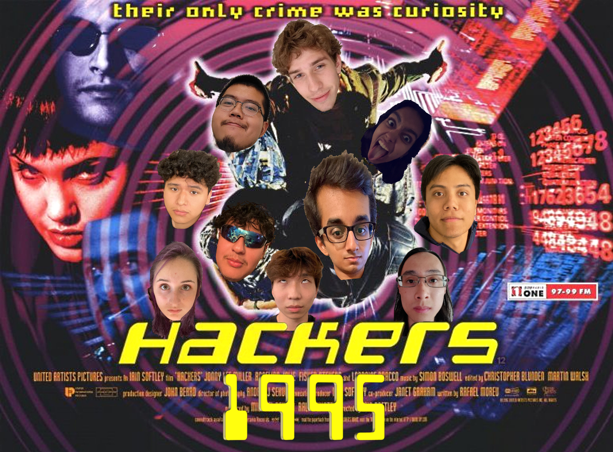

# **Hackers1995**

## **Brand**

## **Values**
- Openness
- Honesty
- Respect
- Integrity
- Diversity/Inclusion

## **Roster**
### **TA: Gagan Gopalaiah**

### **Team Lead: Rhea Bhutada**
- #### About Me: 
  - My name is Rhea Bhutada and I am currently a CS major and CogSci minor at ERC. The intersection between neuroscience and computer science really fascinates me and I generally try to apply myself to projects that deal with the overlap of both of these fields. This year I'm working as an undergraduate researcher at the Swartz Center for Computational Neuroscience, which has been an extremely cool experience. Other than that I love to stay active. I used to play basketball in high school and was in an NCAA commercial with Shaq. But lately, I’ve been really into running. Overall, I'm excited to contribute to this project! Although I haven't had too much industry experience, I am interested to see how I can apply my previous course work to backend or frontend design.
- #### Link to Github: https://github.com/rheabhutada02

### **Team Lead: George Dubinin**
- #### About Me:
  - Hello World! I'm a fifth year (3rd year transfer) computer science major from the North Bay Area. Web development has been a big focus of mine since taking Prof Powell's 134B last winter and I'm stoked to be back in the "full stack" developer seat for 110. I am the second the team lead and in addition to my love for leading and working on team projects I am also fascinated by web development technologies including containerization, infrastructure as code (IaC), software as a service (SAAS), and web-based encryption (security). I am also an avid DJ and the traininer manmager for the DJ club on campus. This quarter is shaping up to be a memorable one!
- #### Link to Github: https://github.com/look-its-ashton

### **Gavyn Ezell**
- #### About Me: 
  - My name is Gavyn Ezell and I’m from Hawaii. Currently a 3rd year CS Major at Muir. I love video games, playing piano, and going to the gym. For SWE, backend interests me most (I am not good with design and visuals), and I’m hoping to learn a lot more backend from this project! 
- #### Link to Github: https://github.com/gavyn-ezell

### **Daniel Hernandez**
- #### About Me: 
  - My name is Daniel Hernandez and I am a 3rd year Computer Science major and music minor. Some of my interests in the CS field are ML, AI, and Cybersecurity. Outside of school, I play drums for a local band. For SE, the backend aspect appeals to me the most since I am able to utilize more of what I learned from my past classes. However, I would want to try frontend since I do enjoy design to some extent. 
- #### Link to Github: https://github.com/d7hernan

### **Henry Feng**
- #### About Me:
  - My name is Henry, and I am a 3rd year CS mahor. I was born in China and grew up in New Zealand. I wrote my first line of code, in Python during my second year of high school. My favourite foods are ramen, steak and pasta. Some of my hobbies include playing guitar, hiking, cooking, video games, and music (from the Persona series). I am excited to start this project and hope to contribute to both frontend and backend.
- #### Link to Github: https://github.com/dusk-moon

### **Kara Hoagland**
- #### About Me:
  - My name is Kara Hoagland and I am a 3rd year Computer Engineering major. CS-wise, I'm interested in topics such as computer vision and RFID, but it's hard to limit oneself because there's so many interesting topics out there. Outside of CS, I enjoy D&D, biking, and reading. I got some industry experience over summer and love getting to see how that experience and my previous classes all apply to this project. I'm interested in full stack but more so the backend of things.
- #### Link to Github: https://github.com/KH-Cl

### **Marc Reta**
- #### About Me: My name is Marc Reta and I am a 3rd year Computer Engineering major in Warren College. I love exploring San Diego and going on adventures. I have a huge interest in Public Transportation. I'm looking foward to working with everyone in my group and learn how to create an application. 
- #### Link to Github: https://github.com/Graydogminer

### **Sanjit Joseph**
- #### About Me: 
  - Hi! My name is Sanjit Joseph and I'm a 3rd year CE major at Sixth. I'm from the Bay Area, so I've been surrounded by technology most of my life. I'm into building computers and I waste a lot of time (and money) messing with my PC and playing video games on it. I enjoy things outside of tech, though--as an Eagle Scout, I've done tons of backpacking throughout California and the US. I also hold a black belt in Shotokan Karate. As for this class, I'm pretty excited about all the different aspects of software engineering; frontend and backend both appeal to me, but I'm really just excited to work on a long class project in a team setting.
- #### Link to Github: https://github.com/sm-joseph

### **Isaac Otero**
- #### About Me: 
  -  My name is Isaac Otero, I am a 5th year Cog Sci major. I am interested in front end development. I want to implement what I’ve learned from my design classes into  my projects for front end development. 
- #### Link to Github: https://github.com/Isaac-Otero

### **Arthur Lu**
- #### About Me:
  - My name is Arthur Lu and I am a 3rd year CE major. I am primarily interested in low level systems design, hardware development and optimization, and HPC architecture. I work as an undergraduate research assistant for Prof. Turakhia developing hardware accelerators for long length genome alignment. When I’m not busy, I like to relax with some retro video games. 
- #### Link to Github: https://github.com/ltcptgeneral
