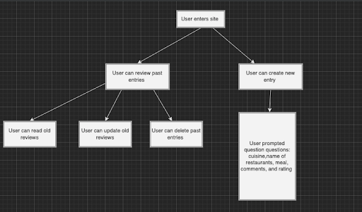

# App Pitch - Food Journal

## Summary

    Our pitch is an app that allows users to store information about their recent restaurant experiences, including the restaurant name, location, date, dish, picture of the food, price, comments, ratings, etc. This app will allow individuals to document their food habits and track past meals. The app will then provide suggestions based on the users preferences and habits.

## Narrowing Down the Problem

    People don’t have a place to reflect on their food adventures. Whether it’s trying a new cuisine or looking into new restaurants, it is useful for people to have a place to record their restaurant experiences. In our research, we found that there is no app designed for people to journal their food related experiences and we feel that this app will offer a new and exciting avenue for people to enjoy and reflect on their meals.

## How is it CRUD?
* Create: Users create reviews of specific foods at any restaurant
* Read: Users read reviews that they’ve created
* Update: Users update their reviews when their ideas change about the food
* Delete: Users may delete their reviews

## Visual Representation
- Home Page: Users sees all their reviews and can perform CRUD actions
- Create New Entry Page: new page with a form is opened up
</img>

## User Personas
### Persona 1: Tom
Tom would often face the issue of not knowing where he should go for his next meal. As someone who is new to the town, Tom does not know the restaurants around his place by heart, let alone the details on each restaurant like the price range, cuisine, and specific dishes likes and dislikes. Tom’s problem is one that can be solved by our app. Whenever he visits a restaurant, he can use our app to note down any relevant information from that visit. And when Tom would need help on deciding where to eat, he can refer to the notes on his food journal to help him make that decision.

### Persona 2: Ben
Ben is trying to make sure that he watches what he eats. He doesn’t mind eating somewhere unhealthy once in a while, but he wants to make sure the majority of his purchasing decisions are healthy. If Ben uses our app, he can place tags on the meals he eats depending on whether they’re healthy or unhealthy. Then, he can look back over the past weeks and months and make sure he hasn’t been eating at too many unhealthy places. If he’s ever looking for something to eat, he can filter by tags on the app to find only healthy places that he’s given high ratings to in the past. This way, he can stay consistent with his dieting goals.

### Persona 3: Claire
Claire noticed that she’s spending more than she would like to on eating out and made a resolution to try to budget how much she’s spending on restaurants. Claire has a general idea of the restaurants in her area, but it’s difficult to keep track of the details of each location. If Claire uses this app, she can note down the price of each food she tries when eating out and how she thought that the quality compared to the price with her budget in mind. She can narrow down foods that she finds worth the price. When craving a certain type of food, Claire can also look for cheaper options in the same category of cuisine based on her previous entries.

# Similar Apps and Competition
* Social media allows users to technically post their own food reviews (food accounts, food review posts), but sites are not specialized for food reviews
* Yelp known for specifically food, but still branches
* Our app differs in scope (focus on food exclusively)
* Our app offers food review-specific features like specialized templates and formats

# Statement of Purpose
Ultimately, the purpose of this app is to allow users to keep a food diary. Having a place that allows individuals to journal their favorite meals, restaurants, cuisines, pictures, and more can be beneficial for people who are looking to know more about their eating habits and tendencies as well as try out new foods.

# Risks and Rabbit Holes
* Technical Unkowns
  * How to implement CRUD related features?
  * Is there a limit to storage? How to store large amounts of data locally?
* Unsolved Design Problems:
  * What features we want to prioritize?
  * How much data will be collecting? 
  * How many fields should we have for each meal?
* Misunderstood Interdependencies:
  * N/A